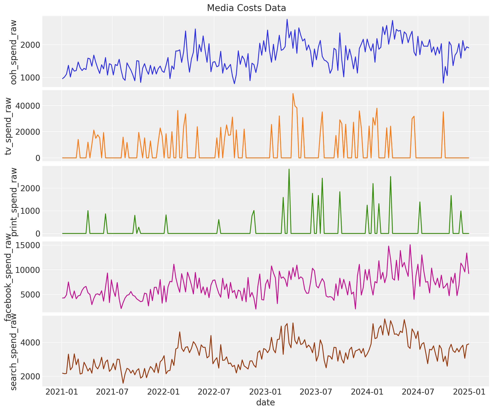
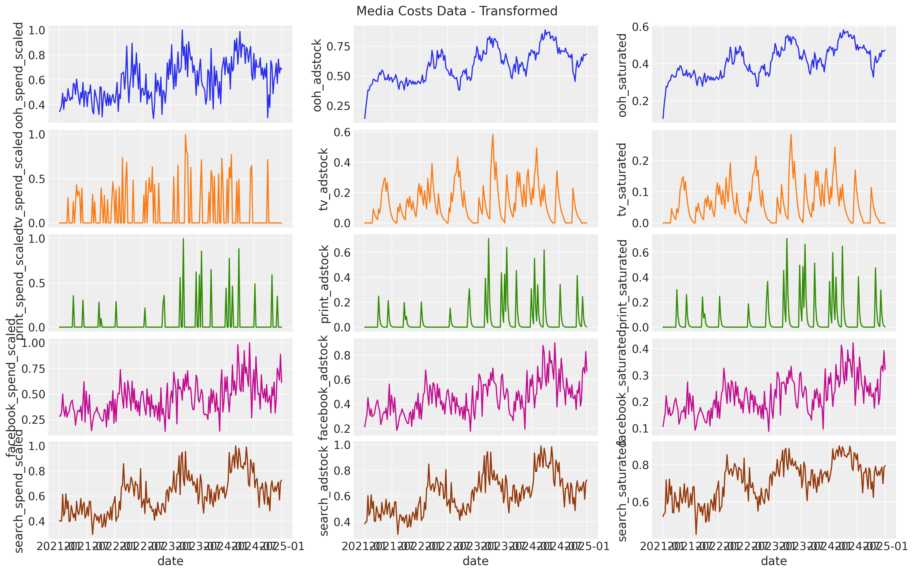

# Implementation of Marketing Mix Modeling

This project is based on the pymc implementation of the MMM presented in the paper [ Jin, Yuxue, et al. “Bayesian methods for media mix modeling with carryover and shape effects.” (2017)](https://research.google/pubs/pub46001/).
Here we work on simulated data to set the parameters ourselves and allow us to conduct a parameter recovery exercise.The data generation process is as an adaptation of the blog posts
[“Media Effect Estimation with PyMC: Adstock, Saturation & Diminishing Returns” ](https://juanitorduz.github.io/pymc_mmm/.) and [Mastering Marketing Mix Modelling In Python](https://medium.com/data-science/mastering-marketing-mix-modelling-in-python-7bbfe31360f9).
It also uses as references this other sources:

🔎 https://github.com/sibylhe/mmm_stan/tree/main  
🔎 https://www.pymc-marketing.io/en/stable/notebooks/mmm/mmm_example.html

## 1. Introduction

**_Marketing mix models or Media mix models_** are used to understand how media spending affects sales, so as to optimize future budget allocation.

These models are usually based on weekly or monthly aggregated national or geo level data. The data may include **sales, price, product distribution, media spend in different channels**, and external factors such as macroeconomic forces, weather, seasonality, and market competition.

**ROAS (return on ad spend)** and **mROAS (marginal ROAS)** are the key metrics to look at. High ROAS indicates the channel is efficient, high mROAS means increasing spend in the channel will yield a high return based on current spending level.

The ultimate goal is to create the best funnel to have the best **ROI (return on investment)**.

--

### 1.1 A completer

--

## 2.Business Case Study

### 2.1 Problem Definition

Let's first define the **business problem** we are trying to solve. We want to optimize **the marketing budget allocation** of our client with the following characteristics:

- **_*Sales data*_**: weekly sales of the client.
- **_*Media spend* data_**: weekly spend on 5 different media channels
- **_*Domain knowledge*_**:
  - We know that there has a been an positive sales trend which we believe comes from a strong economic growth.
  - We also know that there is a yearly seasonality effect.

#IMAGE

There is a causal relationship between marketing and sales, but what is the nature of that relationship? We have to take into account that there is :

- a **carry-over effect (adstock)**. Meaning, the effect of spend on sales is not instantaneous but accumulates over time.
- a **saturation effect**. Meaning, the effect of spend on sales is not linear but saturates at some point

### 2.2 Data Generation

> 📄 Find all the Generation process in the Notebook `1-Data_generation.ipynb`  
>  📄 Find a simplified Data_generation function in the Script `data_generator_function.py`

As described in the section above, we want a dataset with:

- **Sales variables:**
  Sales ( the target variable)

- **Media Variables:**

  - ooh (Out of home spend)
  - tv (Television spend)
  - print (Print media spend)
  - facebook ( Facebook ads spend)
  - search (Google search ads spend)
  - facebook_I (facebook impressions)
  - search_clicks_P (Google search ads performence,number of clicks)

- **Control Variables:**
  competitor_sales_B (competitor sales baseline)

To construct our dataset we considered <u>4 years of weekly data.</u>

From what we know from the domain knowledge, we have described the demand with an increasing trend for organic growth, with a seasonality (oscillation) in the demand each year.

We also created a proxy for demand as in reality, the true demand is never observable, but we can find proxies.

After that, we created synthetic data for each marketing channel.The different channel spends are correlated with demand, and also are designed by different marketing strategy (for example high budget, bursty campaigns for TV, or relatively consistent with moderate noise for out-of-home).

Next, we pass the raw signal through the two transformations: first the geometric adstock (carryover effect) and then the logistic saturation.
For the adstock, we set a maximum lag effect of 8 weeks, and we chose our alpha parameter accordingly to the media:
| Channel | Type |alpha | Justification |
| ---------- | --------------------- | ------------------- | ------------------------------------------------------------------- |
| `tv` | Offline, mass media | **0.5 – 0.8** | Strong long-term effect (brand awareness, memorability) |
| `ooh` | Offline, visual | **0.4 – 0.7** | Moderately lasting impact, repeated exposure in public spaces |
| `print` | Offline, print media | **0.2 – 0.5** | Lower memorability, short-lived effect, rarely drives direct action |
| `facebook` | Digital, paid social | **0.1 – 0.4** | Short-term performance focus, quick decay of impact |
| `search` | Digital, intent-based | **0.0 – 0.2** | No carryover effect: impact is immediate (direct response channel) |

Same for the saturation:

| Channel    | Type                  | λ             | Justification                                                                      |
| ---------- | --------------------- | ------------- | ---------------------------------------------------------------------------------- |
| `tv`       | Offline, mass media   | **0.5 – 1.5** | Strong saturation: TV reach saturates quickly (broad audience)                     |
| `ooh`      | Offline, visual       | **1.0 – 2.0** | Moderate saturation, especially in high-exposure urban areas                       |
| `print`    | Offline, print media  | **1.5 – 3.0** | Low saturation (narrow audience); hard to reach saturation point                   |
| `facebook` | Digital, paid social  | **0.5 – 1.5** | Can saturate fast with high budget, algorithmically optimized                      |
| `search`   | Digital, intent-based | **2.0 – 4.0** | Very low saturation: conversion effectiveness remains linear longer (pull channel) |

And we can visualize the effect signal for each channel after each transformation:

We then add the Facebook impressions and google search clicks, and then the control variable that is the competitor sales baseline ( that also follows trend and seasonality)

Finally, we create our target value, the sales, that we assume it is a linear combination of the effect signal, the trend and the seasonal components, plus the two events and an intercept. We also add some Gaussian noise.

### 2.2 Exploratory Data Analysis and Feature Engineering

> 📄 Find more details on the EDA and FE in `2-EDA and FE.ipynb`

Now that we have our data let's do the exploratory data analysis. (This one will be faster than the usuals because we already know well our dataset given that we constructed it).

We reduced our dataset to only the columns that would be available from real raw data delivered by the company(sales,spend per channel,sales of competitor,impressions and clicks), and start by visualizing them.

We also compare the monthly stats on ad spends:

<table border="1" class="dataframe">
  <thead>
    <tr style="text-align: right;">
      <th></th>
      <th>tv_s</th>
      <th>ooh_s</th>
      <th>print_s</th>
      <th>facebook_s</th>
      <th>search_s</th>
    </tr>
  </thead>
  <tbody>
    <tr>
      <th>count</th>
      <td>209</td>
      <td>209</td>
      <td>209</td>
      <td>209</td>
      <td>209</td>
    </tr>
    <tr>
      <th>mean</th>
      <td>$6,342</td>
      <td>$1,657</td>
      <td>$142</td>
      <td>$6,886</td>
      <td>$3,328</td>
    </tr>
    <tr>
      <th>std</th>
      <td>$11,416</td>
      <td>$436</td>
      <td>$476</td>
      <td>$2,470</td>
      <td>$809</td>
    </tr>
    <tr>
      <th>min</th>
      <td>$0</td>
      <td>$810</td>
      <td>$0</td>
      <td>$2,052</td>
      <td>$1,589</td>
    </tr>
    <tr>
      <th>25%</th>
      <td>$0</td>
      <td>$1,326</td>
      <td>$0</td>
      <td>$4,927</td>
      <td>$2,673</td>
    </tr>
    <tr>
      <th>50%</th>
      <td>$0</td>
      <td>$1,611</td>
      <td>$0</td>
      <td>$6,642</td>
      <td>$3,322</td>
    </tr>
    <tr>
      <th>75%</th>
      <td>$12,002</td>
      <td>$1,959</td>
      <td>$0</td>
      <td>$8,313</td>
      <td>$3,834</td>
    </tr>
    <tr>
      <th>max</th>
      <td>$49,311</td>
      <td>$2,779</td>
      <td>$2,839</td>
      <td>$15,080</td>
      <td>$5,387</td>
    </tr>
  </tbody>
</table>

NB : Media contribution du modele vs de nos données generees à comparer

We can see the current allocations on the different channels but now the question is if this is the most profitable split and spendings.(Always remembering that the ad spends are not the only source explaining the sales).

And now we do a quick feature engineering step befor modeling the process.For this step, we add more layers to describe temporality and we include a trend feature (that will help us see the seasonality as 4 Fourier modes).

<table border="1" class="dataframe">
  <thead>
    <tr style="text-align: right;">
      <th></th>
      <th>date</th>
      <th>sales</th>
      <th>tv_s</th>
      <th>ooh_s</th>
      <th>print_s</th>
      <th>facebook_s</th>
      <th>search_s</th>
      <th>trend</th>
      <th>year</th>
      <th>month</th>
      <th>dayofyear</th>
    </tr>
  </thead>
  <tbody>
    <tr>
      <th>0</th>
      <td>2021-01-04</td>
      <td>162277.109282</td>
      <td>0.0</td>
      <td>963.639807</td>
      <td>0.0</td>
      <td>4296.052070</td>
      <td>2182.363211</td>
      <td>0</td>
      <td>2021</td>
      <td>1</td>
      <td>4</td>
    </tr>
    <tr>
      <th>1</th>
      <td>2021-01-11</td>
      <td>170493.217138</td>
      <td>0.0</td>
      <td>1015.604279</td>
      <td>0.0</td>
      <td>4324.637643</td>
      <td>2151.854375</td>
      <td>1</td>
      <td>2021</td>
      <td>1</td>
      <td>11</td>
    </tr>
    <tr>
      <th>2</th>
      <td>2021-01-18</td>
      <td>144523.455074</td>
      <td>0.0</td>
      <td>1102.396049</td>
      <td>0.0</td>
      <td>4926.757799</td>
      <td>2168.730601</td>
      <td>2</td>
      <td>2021</td>
      <td>1</td>
      <td>18</td>
    </tr>
    <tr>
      <th>3</th>
      <td>2021-01-25</td>
      <td>239399.578756</td>
      <td>0.0</td>
      <td>1371.427530</td>
      <td>0.0</td>
      <td>7538.774028</td>
      <td>3306.440497</td>
      <td>3</td>
      <td>2021</td>
      <td>1</td>
      <td>25</td>
    </tr>
    <tr>
      <th>4</th>
      <td>2021-02-01</td>
      <td>195422.511307</td>
      <td>0.0</td>
      <td>1015.958803</td>
      <td>0.0</td>
      <td>5212.689979</td>
      <td>2378.653779</td>
      <td>4</td>
      <td>2021</td>
      <td>2</td>
      <td>32</td>
    </tr>
  </tbody>
</table>

